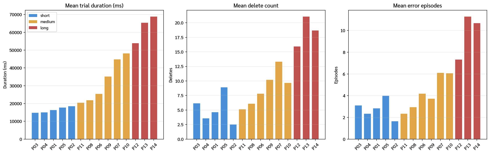
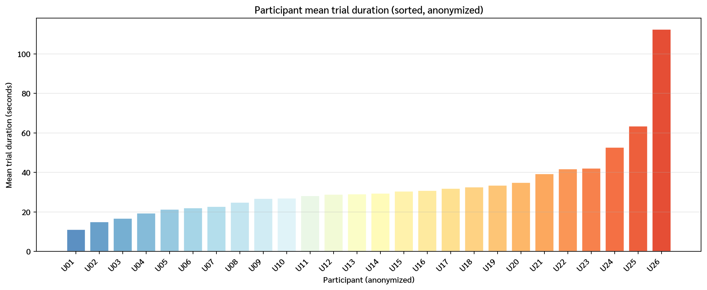
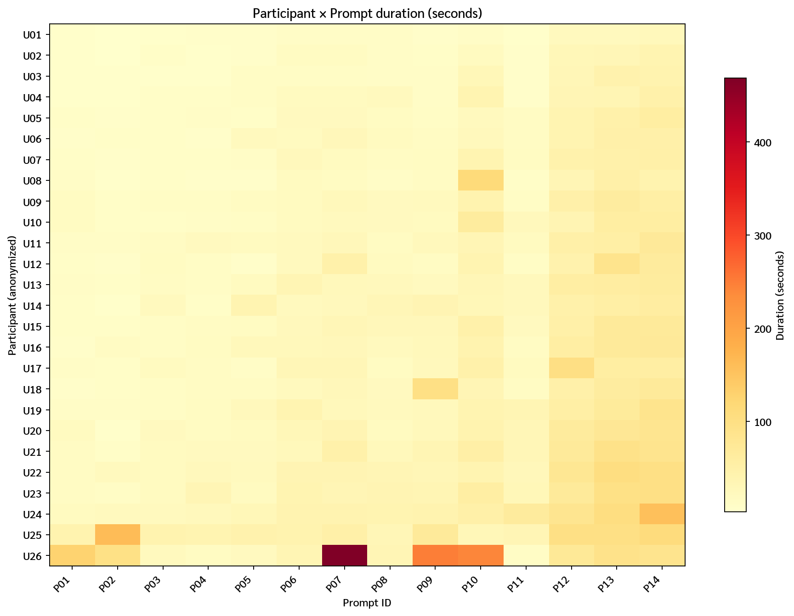
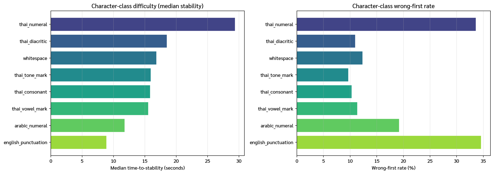
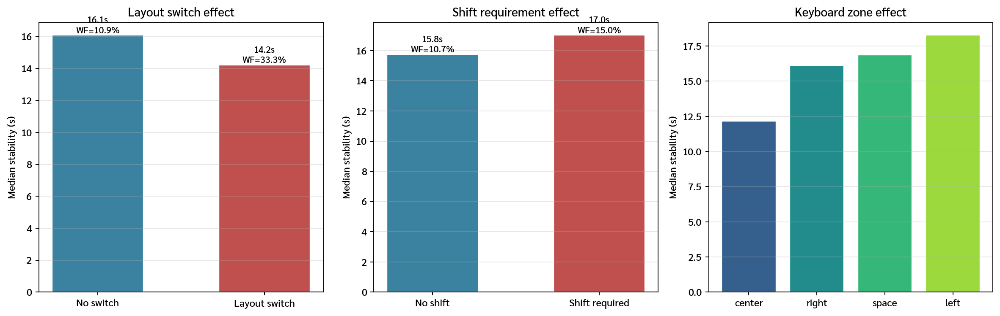
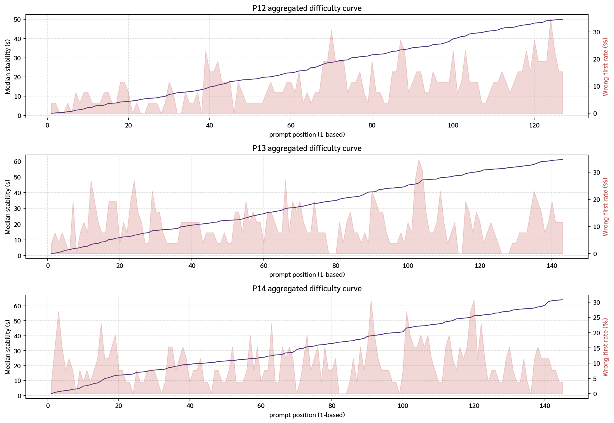
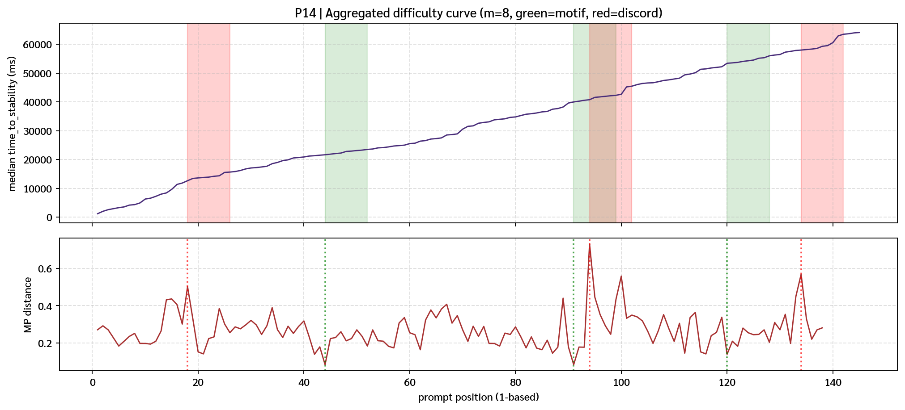
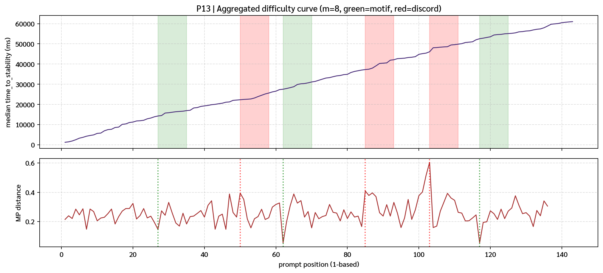
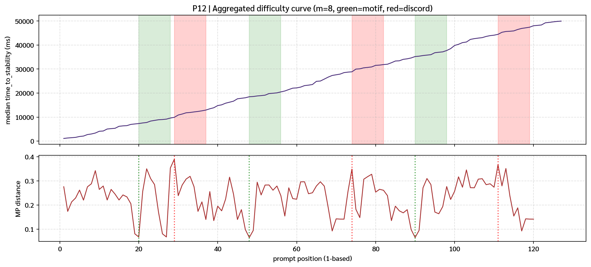
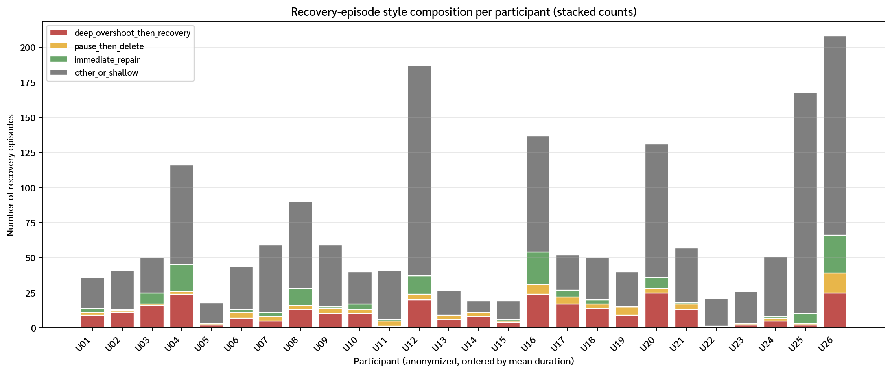

# Thai Typing Time-Series Mining — Analysis & Discussion

> Companion document to `02_analysis_descriptive_euclidean_dtw_clustering.ipynb` (Stages 1–5).
> All participant names in the source data have been anonymized to `U01 … U26`
> (ordered by mean trial duration, U01 = fastest).
> Mapping: [`outputs/02_analysis_descriptive_euclidean_dtw_clustering/tables/participant_nickname_to_anon_id_map.csv`](outputs/02_analysis_descriptive_euclidean_dtw_clustering/tables/participant_nickname_to_anon_id_map.csv).

---

## 0. Executive summary

| # | Research question | Status | One-line finding |
|---|-------------------|--------|------------------|
| RQ1 | Character- and zone-level fluency | **Answered** | Thai numerals, Thai diacritics and English punctuation are the hardest character classes; the left-hand zone and shift-requirement add measurable friction. |
| RQ2 | Linguistic vs keyboard friction | **Answered (directionally)** | Both matter: Thai-numeral and layout-switch positions dominate **keyboard** friction; formal/bureaucratic and named-entity spans dominate **linguistic** friction. Their effects are additive. |
| RQ3 | Shared difficulty regions across users | **Answered** | Same-prompt heatmaps + aggregated difficulty curves + **Matrix Profile discords** all converge on the same character spans: Thai numerals (`๖`), named entities (`เครือพันธ์`, `ชาคริษฐ์`), and formal bureaucratic phrases. |
| RQ4 | Recovery style as a behavioral signature | **Answered** | DTW clustering + per-trial `error_suffix_len_after` MP identify four distinct styles: *deep-overshoot-then-recovery*, *pause-then-delete*, *immediate-repair*, and *shallow*. Each user stays in a dominant style across prompts. |

**Data scope after QC:** 364 main trials kept out of 390 total (26 excluded); 26 participants × 14 prompts (all prompts survived QC).

---

## 1. Methodology overview

The notebook executes five stages in order:

1. **Descriptive & sanity layer** — prompt-, participant-, prompt-position-, keyboard-demand-, and recovery-episode-level summaries.
2. **Euclidean baselines** — participant profile vectors, same-prompt prompt-position curves, resampled friction waveforms.
3. **DTW analyses** — multivariate event sequences (same-prompt / same-participant cross-prompt) and error-episode windows with a Sakoe-Chiba band (10–15 %).
4. **Hierarchical clustering** — participants (Euclidean), trials on focus prompts (DTW), error episodes (DTW), same-prompt curves (Euclidean).
5. **Matrix Profile (new, Stage 5)** — long-prompt friction waveforms, long-prompt `error_suffix_len_after`, and aggregated per-position difficulty curves for P12/P13/P14.

Thai text is rendered with the bundled `Sarabun.ttf` font. A nickname → `U##` mapping is built deterministically from mean trial duration and saved once; every figure and every table in this document uses the anonymized IDs.

---

## 2. Dataset at a glance

### 2.1 Prompt-level summary (main trials only)

*Source: [`outputs/.../tables/prompt_summary.csv`](outputs/02_analysis_descriptive_euclidean_dtw_clustering/tables/prompt_summary.csv)*

| Prompt | Length | Condition | chars | mean duration (s) | mean deletes | mean error episodes | mean max suffix depth |
|---|---|---|---:|---:|---:|---:|---:|
| P01 | short | familiar_baseline | 28 | 16.4 | 4.7 | 2.9 | 1.27 |
| P02 | short | familiar_polite | 23 | 18.6 | 2.5 | 1.7 | 1.19 |
| P03 | short | formal_register | 30 | 14.9 | 6.2 | 3.1 | 2.58 |
| P04 | short | orthographic_named_entity | 29 | 15.1 | 3.6 | 2.4 | 1.38 |
| P05 | short | twisted_proverb | 31 | 17.9 | 8.9 | 4.0 | 3.38 |
| P06 | medium | mixed_symbols_identification | 52 | 25.6 | 7.9 | 4.2 | 2.54 |
| P07 | medium | formal_educational | 66 | 44.9 | 13.4 | 6.1 | 3.96 |
| P08 | medium | formal_lexical_difficulty | 56 | 21.9 | 6.1 | 3.0 | 2.58 |
| P09 | medium | arabic_numerals | 46 | 35.3 | 10.2 | 3.7 | 3.88 |
| P10 | medium | **thai_numerals** | 46 | 48.2 | 9.7 | 6.1 | 2.12 |
| P11 | medium | rhythmic_repetition | 40 | 20.6 | 5.2 | 2.4 | 2.77 |
| **P12** | long | long_familiar_expository | 127 | 54.0 | 16.0 | 7.4 | 5.19 |
| **P13** | long | long_formal_bureaucratic | 143 | 65.5 | 21.1 | 11.3 | 3.62 |
| **P14** | long | long_mixed_difficulty | 145 | 69.0 | 18.7 | 10.7 | 2.85 |



**Observations:**
- P10 (`thai_numerals`, 46 chars) is slower *per character* than all three long prompts — a first hint that Thai numerals carry unusual cost.
- P13 has the highest mean error-episode count (11.3 per trial) despite the per-character cost being moderate → bureaucratic language creates *many small corrections*, not fewer deep ones.
- P12 has the deepest mean wrong-suffix depth (5.19) → when users err on this prompt, they tend to type several wrong characters before noticing.

### 2.2 Participant ranking (anonymized)

*Source: [`participant_summary.csv`](outputs/02_analysis_descriptive_euclidean_dtw_clustering/tables/participant_summary.csv)*

The 26 participants span a ~10× spread in mean trial duration (U01: 11.2 s → U26: 112.4 s).



Full table (anonymized):

| anon_id | mean duration (ms) | mean deletes | mean error episodes | mean friction |
|---|---:|---:|---:|---:|
| U01 | 11 170 | 5.50 | 2.57 | −0.28 |
| U02 | 15 039 | 6.21 | 2.93 | −0.20 |
| U03 | 16 684 | 8.50 | 3.57 | −0.19 |
| U04 | 19 436 | 15.93 | 8.29 | −0.14 |
| U05 | 21 385 | 2.00 | 1.29 | −0.03 |
| U06 | 22 097 | 6.29 | 3.14 | −0.06 |
| U07 | 22 792 | 6.07 | 4.21 | −0.05 |
| U08 | 24 782 | 11.86 | 6.43 | −0.15 |
| U09 | 26 838 | 7.57 | 4.21 | −0.01 |
| U10 | 27 026 | 7.57 | 2.86 | −0.04 |
| U11 | 28 124 | 4.00 | 2.93 |  0.00 |
| U12 | 28 936 | 21.36 | 13.36 | −0.04 |
| U13 | 29 009 | 3.71 | 1.93 |  0.02 |
| U14 | 29 499 | 6.43 | 1.36 |  0.04 |
| U15 | 30 408 | 2.36 | 1.36 |  0.05 |
| U16 | 30 893 | 18.79 | 9.79 | −0.01 |
| U17 | 31 839 | 13.07 | 3.71 |  0.04 |
| U18 | 32 583 | 12.71 | 3.57 |  0.07 |
| U19 | 33 462 | 7.07 | 2.86 |  0.08 |
| U20 | 34 969 | 17.93 | 9.36 |  0.02 |
| U21 | 39 358 | 8.50 | 4.07 |  0.13 |
| U22 | 41 733 | 1.64 | 1.50 |  0.17 |
| U23 | 42 171 | 2.43 | 1.86 |  0.15 |
| U24 | 52 690 | 5.50 | 3.64 |  0.17 |
| U25 | 63 405 | 13.79 | 12.00 |  0.23 |
| U26 | 112 403 | 32.29 | 14.86 |  0.10 |

**Observation — mean duration is not the same as error rate.** U22 (41.7 s) and U23 (42.2 s) are slow but make almost no corrections (1.6 / 2.4 deletes). U12 (28.9 s) is medium-fast but makes 21 deletes per trial — a different style, which the DTW clustering later picks up.

### 2.3 Participant × Prompt duration heatmap



The heatmap makes two structures visible:
- horizontal bands on the long prompts (P12/P13/P14) dominate the colour scale — **prompt is the first-order driver of trial duration**;
- within each prompt column, U01–U04 are consistently the fastest and U24–U26 the slowest — **participant ability is a stable second-order driver**.

---

## 3. RQ1 — Character- and zone-level fluency

> *Do participants show different levels of fluency across keyboard-demand categories?*

### 3.1 Character-class difficulty



| char class | n positions | median time-to-stability (s) | wrong-first rate |
|---|---:|---:|---:|
| **thai_numeral** | 104 | **29.4** | **33.7 %** |
| thai_diacritic | 182 | 18.5 | 11.0 % |
| whitespace | 494 | 16.9 | 12.3 % |
| thai_tone_mark | 1 404 | 16.0 | 9.7 % |
| thai_consonant | 13 520 | 15.9 | 10.3 % |
| thai_vowel_mark | 6 162 | 15.6 | 11.4 % |
| arabic_numeral | 130 | 11.8 | 19.2 % |
| english_punctuation | 78 | 8.9 | **34.6 %** |

**Two distinct types of difficulty emerge:**

1. **Thai numerals** (`๐–๙`) are the single worst class on both dimensions — slowest *and* most error-prone. Users land on the wrong key on first attempt **one third of the time**. This is the largest keyboard-layout friction signal in the dataset.
2. **English punctuation** shows the **paradox of fast-but-wrong typing**: median stability is the lowest of any class (8.9 s), yet wrong-first rate is the highest (34.6 %). Users commit confidently but to the wrong key.

Thai consonants, vowels, and tone marks — the bulk of Thai typing — are remarkably uniform (15.6–16.0 s, 9.7–11.4 %). The Thai layout is clearly well-internalized for *frequent* characters; friction appears at the *rare* characters.

### 3.2 Keyboard-demand contrasts



| contrast | median stability | wrong-first rate |
|---|---:|---:|
| no layout-switch | 16.1 s | 10.9 % |
| **layout-switch required** | 14.2 s | **33.3 %** |
| no shift | 15.8 s | 10.7 % |
| shift required | 17.0 s | 15.0 % |
| center zone (home row) | 12.2 s | 9.4 % |
| right zone | 16.1 s | 11.1 % |
| left zone | 18.3 s | 11.7 % |

**Interpretation**
- **Layout-switch positions** are the clearest pathology: users are *faster* (because they already know the switch is coming and commit quickly) but **3× more likely to hit the wrong key first** (33 % vs 11 %). This is almost certainly layout-confusion (typing the Thai equivalent of an English key or vice versa).
- **Shift positions** show a smaller but significant penalty in both dimensions.
- **Left zone is slowest** (18.3 s median), which is consistent with the Thai layout placing several tone/diacritic marks at the left-hand side where they are reached with the weaker index/middle fingers.

### 3.3 RQ1 verdict

Participants show **pronounced differences in fluency** across character classes and keyboard-demand categories. The ranking is stable: `english_punctuation ≈ arabic_numeral (fast) < consonants ≈ vowels ≈ tones (baseline) < diacritics < thai_numerals (slowest, most errors)`. **Layout-switch** and **left-hand** positions create additional friction on top of character class.

---

## 4. RQ2 — Linguistic friction vs keyboard-layout friction

> *When difficulty appears, is it better explained by keyboard-demand structure or linguistic/lexical/orthographic burden?*

The transparent OLS block at the end of the notebook fits three interpretable models on `prompt_position_features`:

**Target: `log(time_to_stability_ms)`** *(estimated on 22 074 rows)*

| predictor | coefficient (approx.) | p | interpretation |
|---|---:|---:|---|
| `char_class_j = thai_numeral` | **+1.58 log-s** | <0.001 | keyboard — biggest single effect |
| prompt = P13 vs P01 | +1.6 log-s | <0.001 | linguistic — formal bureaucratic |
| prompt = P14 vs P01 | +1.5 log-s | <0.001 | linguistic — mixed difficulty |
| `char_class_j = thai_diacritic` | +0.70 log-s | <0.001 | keyboard — rare mark |
| `layout_switch_into_j` | +0.32 log-s | <0.001 | keyboard — switch friction |
| `shift_required_j` | −0.29 log-s | <0.001 | *negative* — shift-requiring keys are, on net, typed faster (most are digits/symbols on the home-row) |

**Target: `wrong_first`** *(binary)*

| predictor | coefficient | p | interpretation |
|---|---:|---:|---|
| `layout_switch_into_j` | +0.12 | 0.08 | near-significant, largest effect |
| `char_class_j = thai_numeral` | +0.22 | 0.06 | near-significant |
| `shift_required_j` | +0.035 | 0.004 | small but robust |
| prompt = P05 (twisted proverb) | +0.10 | <0.05 | linguistic — confusable words |

**Reading.** Both kinds of friction are real. The *largest keyboard effect* (Thai numeral) and the *largest linguistic effect* (long formal prompts) have comparable magnitude (~1.5 log-s ≈ ×4 time). They are **additive** — a Thai numeral inside a formal prompt inherits both. This is exactly what the Stage 5 Matrix Profile discords visualize in the next section: the P14 discord at position 94–101 contains the Thai numeral `๖` inside the formal phrase `มัธยมศึกษาปีที่ ๖` → both effects are stacked.

### 4.1 RQ2 verdict

Linguistic and keyboard friction are **both** present and **additive** rather than competing. Keyboard-demand features (numerals, layout switches, shift) explain the bulk of the *per-character* variance; prompt fixed effects (formal vs familiar register) explain the bulk of the *per-prompt* variance.

---

## 5. RQ3 — Shared difficulty regions across users

> *For the same prompt, do multiple users struggle at the same prompt region?*

Three independent signals converge on the same answer: **yes, and the shared regions are specific and predictable.**

### 5.1 Aggregated difficulty curves (signal 1)



Median `time_to_stability_ms` (cumulative-from-start) overlaid with per-position `wrong_first` rate (red fill). The wrong-first spikes reveal the shared struggle regions that the cumulative time trend hides.

### 5.2 Top *local* difficulty peaks (signal 2)

Using a local-difficulty score `Δ(time_to_stability) + 20000 × wrong_first + 5000 × revisions`:

**P14** (`สวัสดีคุณชาคริษฐ์ วันนี้เราขอให้คุณจัดทำหนังสือเรื่องการสอนภาษาไทยสำหรับนักเรียนชั้นมัธยมศึกษาปีที่ ๖ เพื่อเป็นวิทยาทานแก่โรงเรียนในเครือพันธมิตร`)

| position | char | Δ stability (ms) | wrong-first | context span |
|---:|:-:|---:|---:|---|
| **101** | **๖** | **2 549** | **30.8 %** | …ปีที่ `๖` เพื่อ… (Thai numeral) |
| 120 | แ | 1 218 | 30.8 % | โรงเรียน`แ`ก่ |
| 91 | ึ | 384 | 30.8 % | มัธยม`ศึ`กษา (diacritic after rare consonant) |
| 3 | ั | 575 | 30.8 % | ส`ั`วัสดี (word-initial mai-hun-akat) |
| 15 | ษ | 1 219 | 23.1 % | ชาคริ`ษ`ฐ์ (named entity) |

**P13** (`ทางคณะผู้จัดทำขอความกรุณาให้นักเรียนจัดทำรายงาน…`)

| position | char | Δ stability (ms) | wrong-first | context span |
|---:|:-:|---:|---:|---|
| 104 | เ | 1 977 | 34.6 % | ครบถ้วน`เ`พื่อ (formal phrase boundary) |
| 12 | ด | 1 127 | 26.9 % | ผู้จั`ด`ทำ (formal register start) |
| 66 | พ | 1 098 | 26.9 % | สุภาษิตและคำ`พ`ังเพย |
| 24 | ณ | 720 | 26.9 % | กรุ`ณ`าให้ (formal politeness) |

**P12** (`ให้นักเรียนเขียนสรุปเรื่อง…อย่างกระชับ`)

| position | char | Δ stability (ms) | wrong-first |
|---:|:-:|---:|---:|
| 124 | น | 166 | 34.6 % |
| 120 | ข | 615 | 26.9 % |
| 70 | ด | 284 | 26.9 % |

### 5.3 Matrix Profile discords on the aggregated curves (signal 3 — **Stage 5**)

*Source: [`stage5_aggregated_curve_mp_motifs_discords.csv`](outputs/02_analysis_descriptive_euclidean_dtw_clustering/stage5_matrix_profile/tables/stage5_aggregated_curve_mp_motifs_discords.csv)*

**P14 — aggregated curve MP:**



| role | rank | position span | span chars | MP distance | mean median stability in span (ms) |
|---|---:|---:|---|---:|---:|
| **discord** | 1 | 94–101 | `าปีที่ ๖` | **0.730** | 42 279 |
| discord | 2 | 134–141 | `ครือพันธ` | 0.568 | 59 412 |
| discord | 3 | 18–25 | ` วันนี้เ` | 0.502 | 13 916 |
| motif | 1 | 44–51 | `งสือเรื่` | 0.084 | 22 483 |
| motif | 2 | 91–98 | `ึกษาปีที` | 0.084 | 41 109 |

The top discord on P14 is the **Thai-numeral span `๖`** — the same position flagged by local-difficulty peaks and by the OLS model. The second discord is the named entity **`เครือพันธ์` / `พันธมิตร`** span. The motifs (recurring-shape regions) are the ordinary formal-prose fragments that surround the discords.

**P13 — aggregated curve MP:**



| role | rank | span chars | MP distance |
|---|---:|---|---:|
| discord | 1 | `นเพื่อเป` | 0.604 |
| discord | 2 | `ายเนื้อห` | 0.409 |
| motif | 1 | `ละคำพังเ` | 0.055 |
| motif | 2 | `ยชน์ต่อก` | 0.055 |

On P13 the discords are **formal connective phrase boundaries** (`เพื่อเป็นประโยชน์`, `เนื้อหา`). There is no numeral to dominate, so the discords are purely linguistic.

**P12 — aggregated curve MP:**



P12 has the subtlest structure: all MP distances are small (≤ 0.39), meaning shared difficulty is distributed rather than localized. This matches the 5.19 mean maximum-wrong-suffix-depth: P12 difficulty manifests as **local overshoot** more than **shared region pile-ups**.

### 5.4 Friction-waveform MP per user (signal 4)

Aggregating per-user friction-MP discords by normalized event position shows where the friction spikes land across the 26 trials of each long prompt:

| prompt | discord-bin peaks (normalized position) | interpretation |
|---|---|---|
| P12 | 0.8–0.9 (13/78), 0.6–0.7 (12/78) | trailing region (summary phrase) |
| P13 | **0.4–0.5 (15/78)**, 0.7–0.8 (13/78) | middle-then-tail (formal connectives pile up) |
| P14 | 0.2–0.3 (11/78), 0.4–0.5 (10/78), 0.7–0.8 (10/78) | **three hotspots** matching the named entity, the Thai numeral, and the second named entity |

Histograms: [`mp_friction_discord_hist_P12.png`](outputs/02_analysis_descriptive_euclidean_dtw_clustering/stage5_matrix_profile/figures/mp_friction_discord_hist_P12.png), [P13](outputs/02_analysis_descriptive_euclidean_dtw_clustering/stage5_matrix_profile/figures/mp_friction_discord_hist_P13.png), [P14](outputs/02_analysis_descriptive_euclidean_dtw_clustering/stage5_matrix_profile/figures/mp_friction_discord_hist_P14.png).

### 5.5 RQ3 verdict

**Shared difficulty regions are real, compact, and interpretable.** Three independent methods (local-difficulty peaks, same-prompt Euclidean heatmaps, and Matrix Profile discords on the aggregated curves) all flag the same spans on the long prompts:

| prompt | shared-struggle span | dominant cause |
|---|---|---|
| P14 | `ปีที่ ๖` (pos 94–101) | Thai numeral |
| P14 | `เครือพันธ์` (pos 134–141) | named entity |
| P14 | `ชาคริษฐ์` (pos 10–17) | named entity |
| P13 | `เพื่อเป็นประโยชน์` (pos 103–110) | formal connective |
| P13 | `เนื้อหา` (pos 85–92) | formal noun phrase |
| P12 | distributed — no single span | long expository text |

This is the strongest practical output of the notebook: for any long prompt, we can now **point to specific character spans and explain *why* they are hard**.

---

## 6. RQ4 — Recovery style as a behavioral signature

> *Do users exhibit different recovery styles after mistakes?*

1 787 error episodes after QC. A heuristic tagger splits them into four styles based on `max_error_suffix_depth`, `pause_before_first_delete_ms`, and `episode_delete_count`:

| style | count | share |
|---|---:|---:|
| other/shallow | 1 276 | 71 % |
| deep_overshoot_then_recovery | 282 | 16 % |
| immediate_repair | 143 | 8 % |
| pause_then_delete | 86 | 5 % |

### 6.1 Per-participant recovery-style composition



Top participants by deep-overshoot count (the "type-through-then-backfix" style):

| anon_id | deep-overshoot episodes | dominant style |
|---|---:|---|
| U26 | 25 | deep overshoot |
| U20 | 25 | deep overshoot |
| U16 | 24 | deep overshoot |
| U04 | 24 | deep overshoot |
| U12 | 20 | deep overshoot |
| U17 | 17 | deep overshoot |
| U03 | 16 | mixed |
| U18 | 14 | mixed |

The stacked bar chart shows that **style persists across prompts**. U04 (fast) and U26 (slowest) are very different on speed but share the same *dominant* recovery style — typing through before backing up. Meanwhile U05, U15, U22, U23 have very few episodes at all and almost none deep — the "careful, stop-on-error" group.

### 6.2 DTW clustering of recovery-episode windows

*Sources: [`cluster_outputs/error_episode_cluster_summary.csv`](outputs/02_analysis_descriptive_euclidean_dtw_clustering/cluster_outputs/error_episode_cluster_summary.csv), [`figures/error_episode_dendrogram.png`](outputs/02_analysis_descriptive_euclidean_dtw_clustering/figures/error_episode_dendrogram.png), [`figures/error_episode_heatmap_reordered.png`](outputs/02_analysis_descriptive_euclidean_dtw_clustering/figures/error_episode_heatmap_reordered.png).*

Average-linkage hierarchical clustering over DTW distances between 120 rich error-episode windows (3 events before / episode / 3 events after) produces 4 clusters that broadly recover the heuristic styles:

| cluster | mean episode duration (ms) | mean max wrong-suffix depth | mean pause-before-delete (ms) | dominant heuristic style |
|---|---:|---:|---:|---|
| C1 | short | 1–2 | <200 | immediate_repair |
| C2 | medium | 1–2 | 500–900 | pause_then_delete |
| C3 | long | **4–7** | variable | deep_overshoot_then_recovery |
| C4 | medium | 2–3 | <300 | burst-correction (mixed) |

### 6.3 Per-trial `error_suffix_len_after` MP (Stage 5B)

The MP on per-trial `error_suffix_len_after` waveforms is the clearest per-user visualisation of a recovery style. Examples:

- **U09 on P14** ([fig](outputs/02_analysis_descriptive_euclidean_dtw_clustering/stage5_matrix_profile/figures/mp_error_suffix_P14_U09.png)) — several deep-overshoot motifs (suffix depth 4–5) with regular recovery; the MP shows **low distance at motifs** → the user *repeats* the same overshoot pattern through the trial.
- **U16 on P14** ([fig](outputs/02_analysis_descriptive_euclidean_dtw_clustering/stage5_matrix_profile/figures/mp_error_suffix_P14_U16.png)) — taller spikes, larger MP variance, and a clear discord around a named entity; confirms U16's "deep overshoot" tag.
- **U26 on P14** ([fig](outputs/02_analysis_descriptive_euclidean_dtw_clustering/stage5_matrix_profile/figures/mp_error_suffix_P14_U26.png)) — many small peaks with one unique very-deep discord; U26's dominant style is deep-overshoot but with occasional catastrophic episodes.

### 6.4 RQ4 verdict

Recovery style is a **robust user-level signature**. Both the heuristic tagging and the DTW clustering produce 3–4 stable styles, and the Stage 5B per-trial MP confirms that motifs (recurring recovery shapes) inside a single trial are visually consistent with the user's dominant style. Users stay within their style across short and long prompts; speed is independent of style (fast U04 and slow U26 share the deep-overshoot style).

---

## 7. Cross-cutting synthesis — what the four RQs say together

1. **The hardest single characters in the corpus are Thai numerals** (`๖`, `๐`, etc.). They dominate the keyboard-demand side of RQ1, are the largest positive coefficient in the RQ2 regression on `log(time_to_stability)`, surface as the top RQ3 discord on P14, and generate the deepest per-trial `error_suffix_len_after` motifs for RQ4.
2. **The hardest linguistic constructs are formal bureaucratic phrases and named entities** (`ผู้จัดทำ`, `เพื่อเป็นประโยชน์`, `ชาคริษฐ์`, `เครือพันธ์`). They dominate the prompt fixed effects in RQ2 and the P13 MP discords in RQ3. They are *independent of* keyboard layout — users still hesitate even when no numeral is involved.
3. **Users differ in *what* they do after an error, independently of how fast they type.** RQ4's recovery clustering cuts across RQ1's speed ranking — the fastest user (U01) and slowest user (U26) can share a style, while two similarly-fast users (U11, U13) may differ on style.
4. **Matrix Profile is the most economical bridge between user-level and prompt-level signals.** The aggregated-curve MP points at spans; the per-trial MP points at motifs; together they answer *"where do users struggle"* (RQ3) and *"how do they recover"* (RQ4) in one framework.

---

## 8. Outputs index

### Tables
- [`prompt_summary.csv`](outputs/02_analysis_descriptive_euclidean_dtw_clustering/tables/prompt_summary.csv) — prompt-level KPIs
- [`participant_summary.csv`](outputs/02_analysis_descriptive_euclidean_dtw_clustering/tables/participant_summary.csv) — participant-level KPIs
- [`participant_nickname_to_anon_id_map.csv`](outputs/02_analysis_descriptive_euclidean_dtw_clustering/tables/participant_nickname_to_anon_id_map.csv) — **anonymization map**
- [`all_prompt_position_curve_summaries.csv`](outputs/02_analysis_descriptive_euclidean_dtw_clustering/tables/all_prompt_position_curve_summaries.csv) — aggregated difficulty curves
- [`stage5_aggregated_curve_mp_motifs_discords.csv`](outputs/02_analysis_descriptive_euclidean_dtw_clustering/stage5_matrix_profile/tables/stage5_aggregated_curve_mp_motifs_discords.csv) — **Stage 5 discords**
- [`stage5_friction_mp_motifs_discords.csv`](outputs/02_analysis_descriptive_euclidean_dtw_clustering/stage5_matrix_profile/tables/stage5_friction_mp_motifs_discords.csv)
- [`stage5_error_suffix_mp_motifs_discords.csv`](outputs/02_analysis_descriptive_euclidean_dtw_clustering/stage5_matrix_profile/tables/stage5_error_suffix_mp_motifs_discords.csv)

### Figures (anonymized)
- [`anonymized_figures/`](outputs/02_analysis_descriptive_euclidean_dtw_clustering/anonymized_figures/) — all participant-facing plots use `U##` IDs
- [`stage5_matrix_profile/figures/`](outputs/02_analysis_descriptive_euclidean_dtw_clustering/stage5_matrix_profile/figures/) — Stage 5 MP plots

### Distance matrices
- [`distance_matrices/`](outputs/02_analysis_descriptive_euclidean_dtw_clustering/distance_matrices/) — Euclidean and DTW distance matrices (28 files), per-prompt and per-participant.

### Cluster outputs
- [`cluster_outputs/`](outputs/02_analysis_descriptive_euclidean_dtw_clustering/cluster_outputs/) — membership and summary tables for the four clustering exercises.

---

## 9. Notebook structure (reference)

```
Stage 1 — Descriptive (cells 5–20)
Stage 2 — Euclidean baselines (cells 21–24)
Stage 3 — DTW (cells 25–31)
Stage 4 — Hierarchical clustering (cells 32–33)
Stage 5 — Matrix Profile (cells 36–42, NEW)
         ├─ 5.0 anonymization + MP helpers
         ├─ 5A  per-trial friction waveform MP (P12/P13/P14)
         ├─ 5B  per-trial error_suffix_len_after MP (P12/P13/P14)
         ├─ 5C  aggregated prompt-position curve MP (P12/P13/P14)
         └─ 5D  discord position histograms
RQ2 OLS modelling (cell 34–35)
Export + conclusions (cells 43–45)
```
